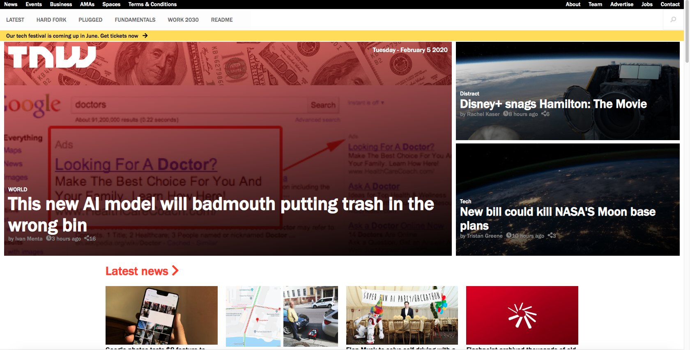

# the-next-web-clone

> The Next web Clone.

Additional description about the project and its features.

## Built With

- HTML,
- CSS,

## Live Demo

[Live Demo Link](https://unruffled-jackson-976106.netlify.com)

## Getting Started

To get a local copy up and running follow these simple example steps.

### clone the app

### open the index.html file in your browser

## Authors

👤 **Patrick Nyatindo**

- Github: [@githubhandle](https://github.com/nyatindopatrick)
- Twitter: [@twitterhandle](https://twitter.com/nyatindopatrick)
- Linkedin: [linkedin](https://linkedin.com/in/nyatindopatrick)

👤 **Kekeli Dogbevi Jiresse**

- Github: [@githubhandle](https://github.com/kelibst)
- Twitter: [@twitterhandle](https://twitter.com/keli_booster)
- Linkedin: [linkedin](https://www.linkedin.com/in/kekeli-dogbevi-958272108/)

## 🤝 Contributing

Contributions, issues and feature requests are welcome!

Feel free to check the [issues page](https://github.com/kelibst/the-next-web-clone/issues).

## Show your support

Give a ⭐️ if you like this project!

## Acknowledgments

- The Next web
- Microverse TSC

## 📝 License

This project is [MIT](lic.url) licensed.
